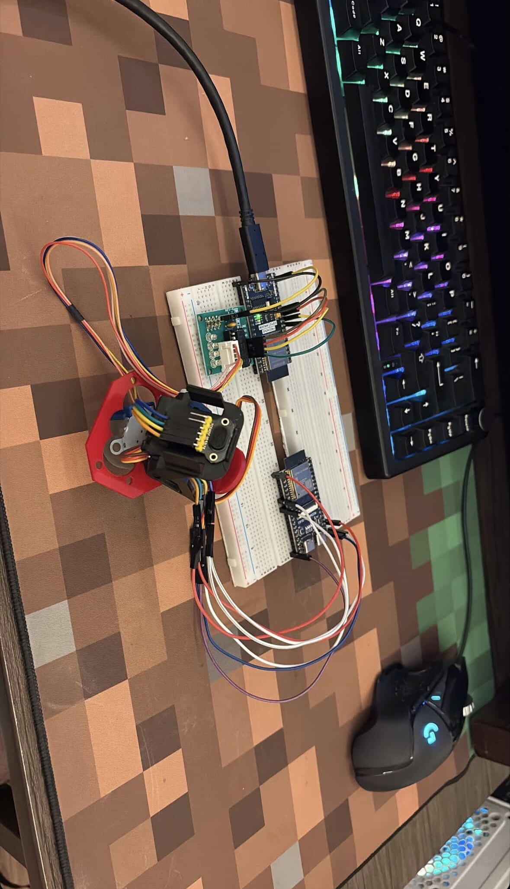

# 3D Spatial Eye

[](https://www.python.org/downloads/)
[](https://opensource.org/licenses/MIT)
[](https://www.raspberrypi.org/)

A real-time 3D point cloud scanner for Raspberry Pi 5, featuring a web-based visualization interface and export capabilities to industry-standard formats.

<!-- 

*Add a demo GIF or screenshot showing the scanner in action*
-->


## Features

- **Real-time 3D Visualization** - Web-based Three.js viewer accessible from any device on the network
- **Time-of-Flight Sensing** - VL53L1X TOF sensor for accurate distance measurements up to 4 meters
- **Full Hemisphere Scanning** - Servo sweeps 0-180 degrees vertically, stepper rotates 360 degrees horizontally
- **Export Formats** - Save scans to PLY (MeshLab, Blender) and PCD (Point Cloud Library, ROS) formats
- **Simulation Mode** - Test the full system without hardware for development and debugging
- **Responsive Web UI** - Modern dark theme interface with real-time progress tracking

## Hardware Requirements

| Component | Model | Purpose |
|-----------|-------|---------|
| Single Board Computer | Raspberry Pi 5 | Main controller |
| TOF Sensor | VL53L1X | Distance measurement (up to 4m) |
| Servo Motor | SG90 / MG996R | Vertical sweep (0-180 degrees) |
| Stepper Motor | 28BYJ-48 + ULN2003 | Horizontal rotation (360 degrees) |

## Wiring Diagram

```
Raspberry Pi 5 GPIO (BCM numbering)
+-----------------------------------------------+
|                                               |
|   GPIO 17 ──────────> Servo Signal (PWM)      |
|                                               |
|   GPIO 5  ──────────> Stepper IN1             |
|   GPIO 6  ──────────> Stepper IN2             |
|   GPIO 13 ──────────> Stepper IN3             |
|   GPIO 19 ──────────> Stepper IN4             |
|                                               |
|   GPIO 2 (SDA) ─────> VL53L1X SDA             |
|   GPIO 3 (SCL) ─────> VL53L1X SCL             |
|                                               |
|   3.3V ─────────────> VL53L1X VIN             |
|   5V ───────────────> Servo VCC, Stepper VCC  |
|   GND ──────────────> All GND connections     |
|                                               |
+-----------------------------------------------+
```

<!--  -->

## Quick Start

### Installation

```bash
# Clone the repository
git clone https://github.com/HayatAhmad05/3d-spatial-eye.git
cd 3d-spatial-eye

# Create virtual environment
python3 -m venv venv
source venv/bin/activate  # On Windows: venv\Scripts\activate

# Install dependencies
pip install -r requirements.txt
```

### Raspberry Pi Setup

```bash
# Enable I2C and install pigpio for hardware PWM
sudo raspi-config nonint do_i2c 0
sudo apt install -y pigpio
sudo systemctl enable pigpiod
sudo systemctl start pigpiod
```

### Running the Scanner

```bash
# With hardware connected
python -m pi_scanner.main

# Simulation mode (no hardware required)
python -m pi_scanner.main --simulate

# Custom port
python -m pi_scanner.main --port 8080
```

Then open your browser to `http://<pi-ip>:5000`

## Usage

### Web Interface

The web interface provides:

- **Start/Stop/Pause** - Control the scanning process
- **Real-time 3D View** - Orbit, zoom, and pan the point cloud
- **Progress Tracking** - View current angles and point count
- **Export** - Download scans as PLY or PCD files

<!--  -->

### Command Line Options

```
Options:
  --simulate    Run without hardware (simulated readings)
  --host HOST   Web server host (default: 0.0.0.0)
  --port PORT   Web server port (default: 5000)
  --debug       Enable verbose debug logging
```

## Architecture

```
pi_scanner/
├── main.py              # Application entry point
├── config.py            # GPIO pins and scan parameters
├── hardware/
│   ├── tof_sensor.py    # VL53L1X I2C interface
│   ├── servo.py         # PWM servo control
│   └── stepper.py       # 28BYJ-48 half-step driver
├── scanner/
│   ├── coordinator.py   # Scan orchestration
│   └── point_cloud.py   # Point cloud data structure
├── web/
│   ├── server.py        # Flask + WebSocket server
│   └── static/          # Three.js viewer
└── export/
    ├── ply_writer.py    # PLY format export
    └── pcd_writer.py    # PCD format export
```

### Coordinate System

The scanner converts spherical coordinates to Cartesian:

- **Theta (servo)**: 0 degrees = up (+Z), 180 degrees = down (-Z)
- **Phi (stepper)**: 0 degrees = +X, 90 degrees = +Y
- **r**: Distance from TOF sensor in millimeters

```
x = r * sin(theta) * cos(phi)
y = r * sin(theta) * sin(phi)
z = r * cos(theta)
```

## Configuration

Edit `pi_scanner/config.py` to customize GPIO pins and scan parameters:

```python
# GPIO Pins (BCM numbering)
SERVO_PIN = 17
STEPPER_PINS = {'IN1': 5, 'IN2': 6, 'IN3': 13, 'IN4': 19}

# Scan Parameters
SERVO_MIN_ANGLE = 0
SERVO_MAX_ANGLE = 180
SCAN_STEPPER_TOTAL = 360
```

## Export Formats

### PLY (Polygon File Format)
- Compatible with MeshLab, Blender, CloudCompare
- ASCII format for broad compatibility

### PCD (Point Cloud Data)
- Native format for PCL (Point Cloud Library)
- Compatible with ROS (Robot Operating System)

## Contributing

Contributions are welcome! Please feel free to submit a Pull Request.

1. Fork the repository
2. Create your feature branch (`git checkout -b feature/amazing-feature`)
3. Commit your changes (`git commit -m 'Add amazing feature'`)
4. Push to the branch (`git push origin feature/amazing-feature`)
5. Open a Pull Request

## License

This project is licensed under the MIT License - see the [LICENSE](LICENSE) file for details.

## Acknowledgments

- [VL53L1X](https://www.st.com/en/imaging-and-photonics-solutions/vl53l1x.html) - STMicroelectronics TOF sensor
- [Three.js](https://threejs.org/) - 3D visualization library
- [Flask-SocketIO](https://flask-socketio.readthedocs.io/) - Real-time WebSocket support
